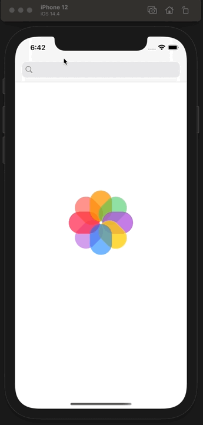

# Weather Application using SwiftUI and UIKit

Hello and welcome. In this repository, you will find Simple Weather Application which is built with **S.O.L.I.D** principal, MVP design patter plus Router, and other useful components. Also with custom transition animations and a few Unit tests.

